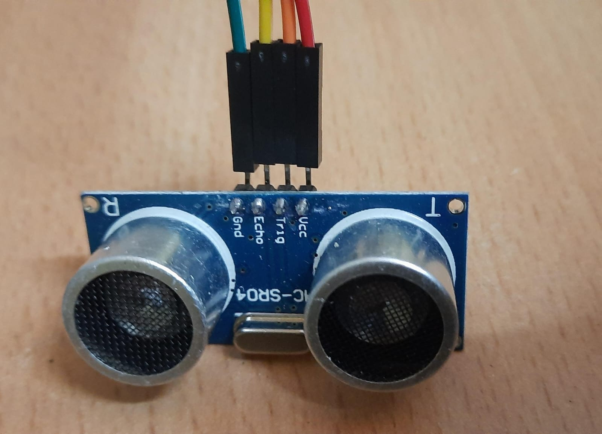

<h1>Ardunio Project</h1>
<h2>Measure the distance to an object using the ultrasonic sensor and turn on the LED if the object is within a certain range
</h2>

This project uses an ultrasonic distance measuring sensor to detect the distance of any object and accordingly turn on the LED light when the object is near the given range(defined)  of the sensor and turn it off when the object moves far from the defined range

<h3>Component used</h3>
<ul>
<li>UNO R3</li>
<li>SENSOR</li>
<li>Connecting Wires</li>
<li>LED LIGHT= Here I have used the primary LED light given on the board itself</li>
</ul>

<h3>About Sensor</h3>

the sensor used is a ultrasonic distance sensor and has 4pins attached to 

<ol>
<li> Vcc</li>
<li>trig</li>
<li> eco</li>
<li>Gnd</li>
</ol>

<h3>HARDWARE CONNECTIONS</h3>

The connections are mentioned below accordingly

<ul>
<li>led at pin 13 of uno</li>
<li>eco pin of sensor to pin 10 of uno
</li>
<li>trig pin of the sensor to 9 of uno</li>
<li>Gnd pin of the sensor to Gnd of Uno</li>
<li>Vcc of sensor to 5V of uno</li>
</ul>
<h3>RESULT</h3>

The light of the led will automatically turn high when the object would be in the defined range and it will automatically turn low when the object is outside of the given range

